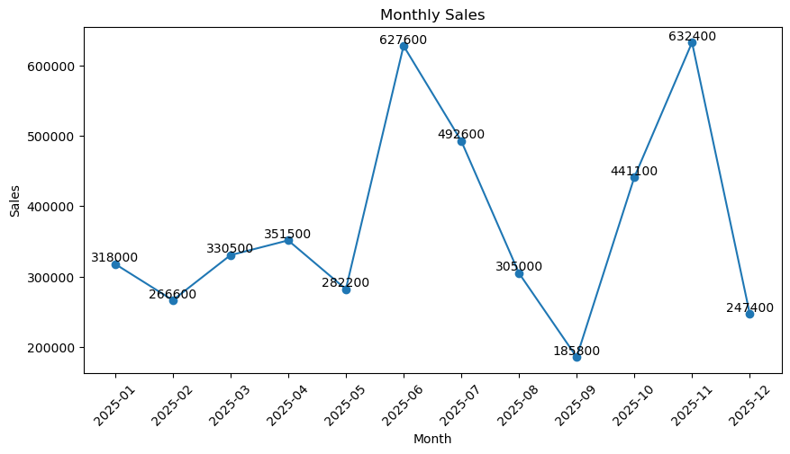
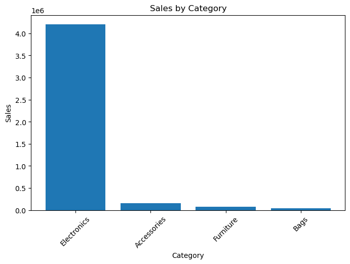
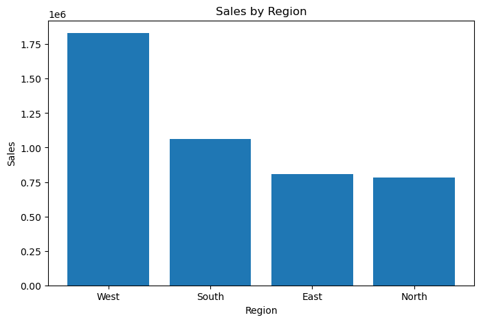
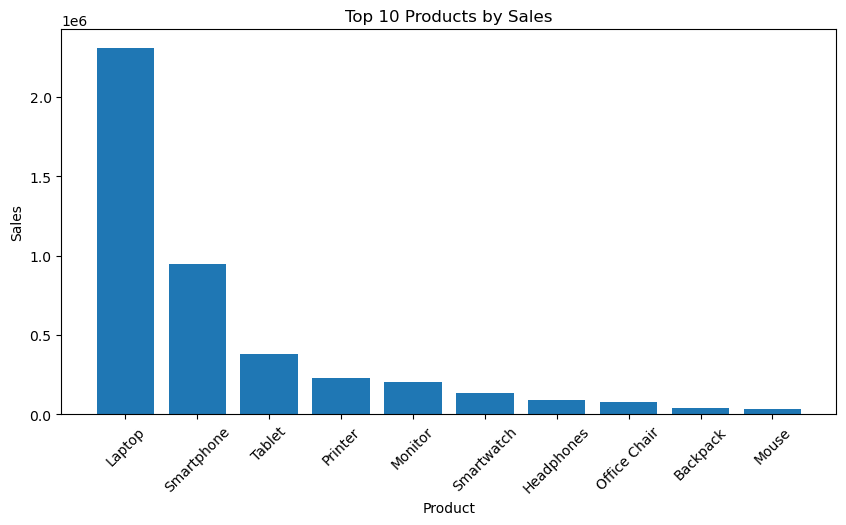
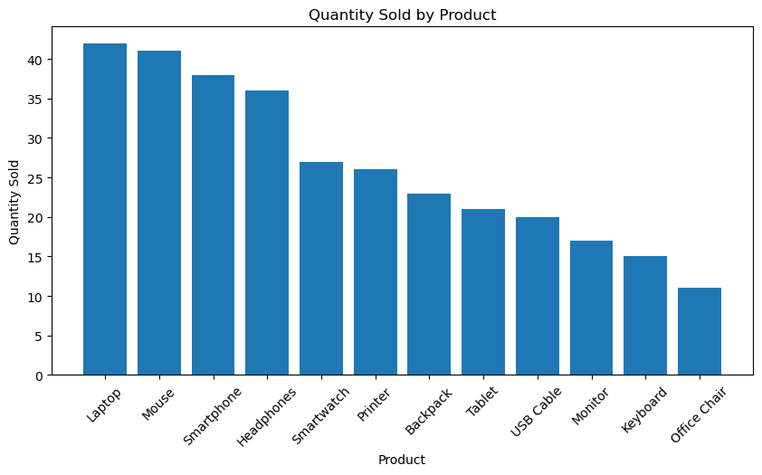

# E-Commerce Sales Analysis

## 📌 Project Overview

This project analyzes an e-commerce sales dataset using Python.The goal is to understand sales performance, identify top-sellingproducts, 
analyze categories and regions, and find monthly sales trends.

## 🛠️ Technologies Used

- Python
- Pandas
- NumPy
- Matplotlib
- Seaborn

## 📂 Dataset

The dataset contains 120 e-commerce orders with information about:

- Order ID
- Order Date
- Product
- Category
- Quantity
- Price
- Region

## 🔧 Data Cleaning

The project includes:

- Checking missing values
- Filling missing prices using the median
- Filling missing regions using the mode
- Converting the order date into date format
- Creating a Sales column

## 📊 Analysis Performed

- Total sales
- Total quantity sold
- Average order value
- Sales by product
- Sales by category
- Sales by region
- Monthly sales
- Best-selling product
- Best-performing region
- Lowest-performing region

## 📈 Visualizations

The project creates charts for:

### Monthly Sales

### Sales by Category

### Sales by Region

### Top 10 Products by Sales

### Quantity Sold by Product

## 🔍 Key Findings

- Total Sales: ₹4,480,700
- Total Quantity Sold: 317 units
- Average Order Value: ₹37,339.17
- Best-Selling Product: Laptop
- Most Sold Product: Laptop
- Best-Selling Category: Electronics
- Best-Performing Region: West
- Lowest-Performing Region: North
- Best Sales Month: November 2025

## 🎯 Conclusion

This project demonstrates how Python can be used to clean,analyze, and visualize e-commerce sales data and extractuseful business insights.
